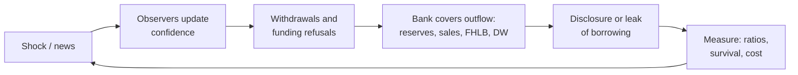

# Liquidity Policy Simulator — PRD

> **Superseded in part by `docs/contract.md` v0.5 (2026-09-30).** The contract governs wherever the two differ. Main changes
> since this PRD was written, mostly from the outside review of Option C (`docs/review-log.md`):
> - **Option C is the full 2026 Treasury design:** a 20% ceiling rising to 30% under funding stress (run as an off / on
>   switch in S1); credit capped at 75 × the average of the 1st, 3rd and 5th largest overnight discount window borrowings
>   over two quarters; default uptake 75%; default HQLA release 100% of credit.
> - **New named variant C′:** C's ceilings with no usage cap and no draw requirement.
> - **Policies compared in v1:** A, B, C, C′ and E.
> - **Bank population:** 40 banks, four types; Category III regional banks (85% LCR) added.
> - **B's five-day test:** 40% of uninsured deposits and 100% of short-term wholesale funding; B's ratio disclosed quarterly.
> - **Routine-borrowing effect:** the more often banks borrow routinely, the lower both market stigma and supervisory and
>   internal reluctance, by the same rule for every policy. Effective stigma is a reported outcome.

Sep 23, 2026 · Mike Hsu · Live version: https://claude.ai/code/artifact/28eff980-9b45-4bb1-88d8-33708d3fc407

## Summary

We will build the Liquidity Policy Simulator, a small, open simulator that shows how a bank run plays out under different discount window readiness policies, and what each policy costs. It is a showcase: small enough to inspect in an afternoon, built so others can extend it.

- **The question:** Which policy best gets a stressed bank to borrow from the discount window in time — a standalone readiness requirement, or credit for discount window capacity inside the Liquidity Coverage Ratio (LCR) — and at what cost? And which feature of each policy does the work?
- **The approach:** A rule-based simulation of one bank and its depositors, supervisor and counterparties over a 30-day stress episode. Runs are paired: every policy faces the same banks, shocks and random draws.
- **The comparison contract:** The bank population, each policy's exact rules, what observers can see and when, the outcomes compared, and the assumptions swept are published before any comparison runs.
- **Stigma:** Not assumed at one value. Market stigma is swept across a range. Jev, a low-cost text-judgment model, places one reference estimate on that range, and the output shows how far it would have to move to reverse the result.
- **What it produces:** A trade-off chart of survival, liquidity shortfall, official support and annual cost; side-by-side replays of the same run under each policy; and a steady-state cost estimate.
- **Timeline:** About 10 weeks to a public v1. Gold-set labeling and outside review are release gates.

## Background

The discount window is the Federal Reserve's standing lending facility for banks. It works only if banks use it before they fail, and for decades they have avoided it. That avoidance is called stigma.

Stigma has three sources, and they call for different fixes:

1. **Operational.** The bank has not pledged collateral in advance or tested a draw, so it cannot borrow fast. Fixed by prepositioning and testing.
2. **Supervisory.** Management expects borrowing to draw supervisory scrutiny or a downgrade. Fixed by how supervisors treat borrowing.
3. **Market.** Management fears that depositors, counterparties or analysts will learn of the borrowing and read it as distress. Fixed only by changing what borrowing signals.

March 2023 showed the cost. Silicon Valley Bank lost roughly $42 billion of deposits in one day. It had not tested its discount window access in 2022 and lacked the collateral and operational arrangements to borrow quickly. The Federal Reserve's review found that stronger contingency funding capacity likely would not have prevented the failure, but could have allowed a more orderly resolution ([Fed review](https://www.federalreserve.gov/publications/2023-April-SVB-Executive-Summary.htm)).

Readiness policy is therefore about buying time and order, not guaranteeing survival. After 2023, U.S. officials floated policies to make readiness routine, and they differ mainly in which source of stigma they target. The deposit figure is approximate, from public post-mortems.

## The question and the options

v1 compares four policies, named by mechanism rather than by who proposed them. E, the mandate alone, is in v1 because it separates the effect of operational readiness from the effect of a new ratio. Exact rules are in the comparison contract below.

| ID | Policy | How it works | Prepositioning | Test draws | Changes the LCR? | Version |
| --- | --- | --- | --- | --- | --- | --- |
| A | Status quo | No new requirement | Voluntary | Voluntary | No | v1 |
| B | Standalone readiness requirement | Reserves + prepositioned discount window capacity must cover 5 days of stressed runnable outflows | Required | Required, periodic | No | v1 |
| C | Capped LCR recognition | Capacity against non-HQLA collateral counts toward the LCR numerator, up to a cap | Voluntary | Voluntary | Yes | v1 |
| E | Mandate only | Required prepositioning and testing, no new ratio or credit | Required | Required | No | v1 |
| C2 | Usage-conditioned recognition | As C, but the cap depends on demonstrated test borrowing | Voluntary | Required for credit | Yes | v2 |
| C3 | Stress-adjustable recognition | As C, with the cap rising during a declared stress | Voluntary | Voluntary | Yes | v2 |
| D | Combined | B's requirement plus C's LCR credit | Required | Required | Yes | v2 |
| C-ext | C with wider LCR scope | As C, with the LCR extended to mid-size banks | Voluntary | Voluntary | Yes | v2 |

B and C differ in several ways at once, so a head-to-head alone cannot say why one does better. v1 therefore also runs each feature as a separate switch: prepositioning mandate, testing mandate, five-day ratio, and LCR credit. Comparing B with E shows what the ratio adds beyond readiness. Comparing C with A shows what LCR credit does on its own.

## Goals, audience and deliverables

Success means a policy reader can see where each option leads, ties or trades off, and why, and a skeptic can rerun the model and get the same answer.

**Goals**

1. Compare A, B, C and E on the same stress episodes, banks and random draws.
2. Attribute differences to specific policy features, not to the policies as bundles.
3. Make every stigma assumption explicit and swept, and show where the result reverses.
4. Show the answer as conditions, not a verdict: "B leads C when X; C leads B when Y; otherwise they trade off."
5. Be small and open enough that others extend it with new policies, scenarios or jurisdictions.

**Non-goals for v1**

- Forecasting any real bank or real episode.
- Modeling the whole banking system. There is one stressed bank; peer contagion comes later.
- Using LLM-driven agents inside the simulation loop.
- An interactive UI. Outputs are static files and one published page.

**Audience:** Bank supervisors, central bank liquidity staff, policy researchers and journalists. They know banking regulation but not simulation.

**Deliverables**

| Deliverable | What it is | Format |
| --- | --- | --- |
| Comparison contract | The fixed terms of the comparison, published before any runs | Page in the repository |
| Trade-off chart | Where each policy leads, ties or trades off across the swept assumptions | PNG + HTML |
| Feature attribution | What each policy feature contributes, from the on/off switches | HTML table |
| Episode replays | The same run under each policy, day by day in plain English | HTML |
| Scorecard | Outcome metrics per policy, scenario and bank type, with intervals | CSV + HTML table |
| Cost estimate | Annual steady-state cost per policy across the 30-bank sample | CSV |
| Signal reference | Jev's reading of each disclosure, with its test results | CSV + method note |
| Code | Public repository on the sponsor's personal GitHub account, with a one-command run | GitHub |

## Comparison contract

Five things are fixed and published before any policy comparison runs. Any change after results are seen requires a dated, public amendment explaining why.

### 1. Bank population

- **30 synthetic banks:** 10 variants of each of three archetypes. The archetypes are a concentrated, uninsured-heavy bank with large unrealized losses (SVB-like); a diversified regional bank; and a large bank with ample liquid assets.
- **How the variants are made:** each draws its uninsured-deposit share, unrealized-loss ratio, liquid-asset share and loan-collateral share from a published range around its archetype, using a fixed seed.
- **One sample throughout:** the same 30 banks feed both the simulation and the cost model.
- **LCR scope held constant:** every policy applies the LCR as it applies to that bank today. Extending the LCR to mid-size banks is a separate policy (C-ext, v2), not part of C.

### 2. Policy rules

| Rule | A | B | C | E |
| --- | --- | --- | --- | --- |
| Prepositioning | Voluntary | Enough to pass the five-day test | Voluntary; uptake swept | Same collateral amount as B |
| Test draws | Voluntary | Required, quarterly | Voluntary | Required, quarterly |
| New ratio | None | (Reserves + post-haircut capacity) ÷ 5-day stressed runnable outflows ≥ 100% | None | None |
| LCR credit | None | None | Post-haircut capacity against non-HQLA collateral, capped at 15% of total net cash outflows | None |

**Option C accounting, specified to avoid double counting:**

- **Eligible collateral:** loans and other non-HQLA assets pledged to the Fed, valued at the Fed's haircuts. Securities pledged to the discount window already count as unencumbered HQLA if the bank can withdraw them without repaying a loan ([Fed](https://www.federalreserve.gov/monetarypolicy/discountrate.htm)). Capacity against them earns no extra credit.
- **Cap:** 15% of total net cash outflows by default, swept from 10% to 25%.
- **After a draw:** borrowed amounts follow existing LCR treatment for discount window loans. Credit for unused capacity falls by the amount drawn.
- **Released HQLA:** a bank may cut HQLA by up to the credit it receives. The share it actually releases, from 0% to 100%, is swept, and released funds go into loans.

**B definitions:** runnable outflows are stressed uninsured deposits plus short-term wholesale funding, with run-off rates as parameters. Test draws are quarterly.

**Feature switches:** prepositioning mandate, testing mandate, five-day ratio and LCR credit can each be turned on or off independently. The four named policies are fixed combinations of these switches.

### 3. What observers can see, and when

The Fed reports discount window lending weekly in aggregate, without naming banks, and names borrowers only two years later ([Fed](https://www.federalreserve.gov/monetarypolicy/discountrate.htm)). So same-week market stigma needs another route. Each route is modeled explicitly.

| Route | What becomes known | Timing | How the model treats it |
| --- | --- | --- | --- |
| Fed weekly aggregate report | Total lending; no bank named | Weekly | Weak signal; more revealing when little other borrowing is happening |
| Fed named disclosure | Borrower names | About 2 years later | Irrelevant within the episode |
| Bank's own announcement or filing | Borrowing or readiness | When the bank chooses, or when material | A bank decision |
| Leak | Named borrowing | Random lag | Probability and lag swept |
| Inference from behavior | Distress signs: asset sales, pulled credit lines | Same or next day | Model mechanics |
| Policy disclosures | B's ratio, or C's LCR including credit | Quarterly, if disclosed | Whether disclosed is a parameter |

Every disclosure template sent to Jev is tagged with one of these routes. A template with no realistic route is not used.

### 4. How a policy "leads"

- **Reported together:** survival rate, liquidity shortfall (outflows the bank could not meet), official support drawn, and annual cost.
- **Paired runs:** every policy faces the same bank, shocks and random draws. Differences are reported with 90% intervals.
- **Leads:** a policy leads in a cell only if it is at least as good on both survival and shortfall, and the interval for at least one excludes zero.
- **Tie or trade-off:** otherwise the cell is shown as a tie, or as a trade-off against cost.
- **No exchange rate:** there is no assumed dollar value for a bank failure, so trade-offs are shown as a frontier, not collapsed into a winner.

### 5. Swept assumptions

| Assumption | Range | Why swept |
| --- | --- | --- |
| Market stigma: chance a known draw is read as distress | None to severe; Jev estimate marked | Cannot be measured directly |
| Supervisory treatment of borrowing | Penalizes to encourages | Depends on future supervisory practice |
| Leak probability and lag | 0–50% within the episode; 0–5 days | No reliable data |
| Voluntary prepositioning uptake under C | 0–100% of banks | Depends on bank incentives |
| Share of HQLA released under C | 0–100% of credit | Depends on bank incentives |
| Prepositioning cost, by collateral type | Opportunity-cost rates by collateral type, ±50% | Estimates vary by collateral |
| Depositor coordination strength | Low to high | Varies with depositor base and media |

## Model design

The model has two layers: arithmetic mechanics and simple behavioral rules. Stigma enters through the swept assumptions in the comparison contract. Jev supplies one reference estimate for market stigma, built offline before any simulation runs.

### Actors

| Actor | State it holds | What it decides each step |
| --- | --- | --- |
| Stressed bank | Reserves, liquid securities (with unrealized losses), loans, prepositioned collateral, deposits by type, wholesale funding | Which funding source to tap next, and whether to borrow from the discount window |
| Fast uninsured depositors | Confidence level | Whether to withdraw same day |
| Slow uninsured depositors | Confidence level, with a lag | Whether to withdraw over several days |
| Insured depositors | Nearly fixed | Rarely withdraw |
| Wholesale counterparties | Perceived survival odds | Roll or refuse maturing funding |
| Supervisor | Ratios, borrowing observed | Escalate, stay silent or encourage borrowing |
| Discount window | Collateral haircuts, processing lag | Not strategic: lends what collateral allows, on a lag |
| Home Loan Bank | Advance capacity, lag | Not strategic: lends first, as in 2023 |

### Each simulated day

Each day has two half-day steps, so the model can show what happens when funds arrive after the payments cutoff. In a one-day run like SVB's, same-day versus next-day access decides the outcome.



A run ends when the bank fails (it cannot meet outflows), stabilizes (outflows stop and liquidity recovers), or reaches day 30.

### How stigma enters the model

The bank borrows from the discount window when the expected cost of not borrowing exceeds the expected cost of borrowing. Each source of stigma enters that comparison through a named, visible input:

- **Operational: mechanical.** Capacity and speed depend on collateral actually prepositioned and on whether a test draw has run recently. Untested access means a 1–3 day lag.
- **Market: route × reading.** The chance borrowing becomes known comes from the information routes in the contract. The chance it is read as distress is swept, with Jev's estimate marked on the sweep. Routine test draws under B and E can lower that reading, but only if the sweep and Jev's estimate both say so.
- **Supervisory: swept.** How supervisors treat borrowing runs from "penalizes" to "encourages".

```latex
\text{borrow if } \; P(\text{fail} \mid \text{no DW}) \cdot L_{\text{fail}} \; > \; P(\text{known}) \cdot P(\text{read as distress}) \cdot L_{\text{run}} + C_{\text{sup}}
```

The policies change the inputs to this rule, not the rule itself. Any difference in outcome traces back to a named policy feature or a named assumption.

## Jev integration

Jev gives a reference estimate of how observers would read each disclosure. It is an input to the sensitivity analysis, not a measurement of market behavior. It runs once, offline, never does arithmetic, and never runs inside the simulation loop.

**What Jev is.** A model from TypeSafe that answers many small, typed questions about one piece of text in a single call: yes/no with a probability, pick-one, or a 2–10 level score. It is cheap and fast at judgment and weak at arithmetic and dates.

### What it can and cannot tell us

- **It can tell us** how a piece of text reads: whether a disclosure sounds like distress or like routine operations.
- **It cannot tell us** whether depositors will withdraw or counterparties will stop lending.
- **The gold set tests language, not behavior.** It checks whether Jev reads text the way people do, not whether markets react that way.

So the market-stigma sweep is the primary result. Jev's estimate is a marker on it, and the output states how far that estimate would have to move to reverse each comparison.

### Three jobs

| Job | Input | Questions asked | Output | When |
| --- | --- | --- | --- | --- |
| 1. Set the sweep range | Public news, analyst notes and filings about discount window and emergency-facility borrowing, 2007–2024 | Does this treat the borrowing as a sign of distress? How severe? | Historical context for the range swept | Before M0 closes |
| 2. Reference estimate | Disclosure templates, each tagged to an information route | For a treasurer, a counterparty and an analyst: does this make you pull back this week? | A marker on the market-stigma sweep per policy | Once per model version |
| 3. Check the replays | Each sentence of a replay plus that run's log | Does the log support this sentence? | Flags for human review | Before publishing replays |

### How the reference estimate is built

1. **Write templates from the routes.** Draft what observers would actually see through each information route in the contract. Drop any template with no realistic route.
2. **Paraphrase each template 3–5 ways.** The spread across paraphrases is reported as uncertainty.
3. **Ask from several vantage points.** One question = one judgment. Combine answers in code, not in the prompt.
4. **Ask both ways.** "Signals distress?" and "Signals routine operations?" Disagreement is flagged.
5. **Test against a gold set.** Two people label 200–300 real passages, and Jev's agreement with them is published. If agreement is poor, no marker is shown and the sweep stands alone.
6. **Freeze and stamp.** Save results with the model version, date, prompt hash and test scores. Every output names the version it used.

### Controls

- All calls go through one client with a full audit log (text hash, questions, answers, model version).
- **Access:** the TypeSafe API directly, with a specific model version recorded on every call. OpenRouter is a fallback for prototyping only.
- Confidence thresholds route low-confidence answers to human review. The thresholds are written down.
- Mock mode lets the pipeline be built without a key. Mock answers are never reported as results.
- Public and synthetic text only. No supervisory or confidential data.

### Budget

| Item | Size | Estimated cost |
| --- | --- | --- |
| Rejected: Jev inside the simulation loop | ~450 million calls | $20,000–40,000, and too slow to be practical |
| Calibration corpus | ~10,000 passages | ~$1–2 |
| Reference estimate | ~5,000 template variants | under $1 |
| Replay checks | ~1,000 calls | negligible |
| Gold-set labeling | 2 labelers × ~300 passages | ~2–3 days each (estimate) |
| Outside review | C specification (M0) and results (M4) | Reviewer time; terms to agree |

Model-call estimates use the listed price of $42 per billion input tokens; confirm current pricing. Rebuilding the estimate costs a few dollars of model calls, so anyone can challenge the templates or questions. The human work is the real cost and a release gate.

## Scenarios and validation

v1 runs two scenarios on the 30-bank sample. Validation checks mechanical facts only. What a policy would have changed is a model result, reported with uncertainty, never something validation confirms.

### Scenarios

| ID | Scenario | Trigger | What it tests | Version |
| --- | --- | --- | --- | --- |
| S1 | Fast idiosyncratic run | Loss disclosure plus social-media coordination | Whether the bank can borrow fast enough | v1 |
| S2 | False alarm | Rumor about a sound bank | Whether a policy causes needless borrowing or false comfort | v1 |
| S3 | Slow burn | Rising rates erode confidence over weeks | Repeated decisions to borrow or not | v2 |
| S4 | Sector run | Shock hits several similar banks | Contagion and how common borrowing is | v2 |
| S5 | Wholesale freeze | Repo and commercial paper markets tighten | Institutional rather than depositor runs | v2 |

### Example banks

The 30 synthetic banks are defined in the comparison contract. Results are reported per archetype as well as overall.

### Validation

| Step | Pattern | Model must reproduce | Used for |
| --- | --- | --- | --- |
| Tune | SVB-like, March 2023 | Size and speed of outflows on days 1–2; failure within about 3 days under status-quo readiness | Setting behavioral parameters |
| Test 1 | Signature-like, March 2023 | Fast run and failure within days, with no retuning | Out-of-sample check |
| Test 2 | First Republic-like, spring 2023 | Heavy borrowing buys weeks but does not prevent failure when losses are deep | Out-of-sample check |
| Sanity | S2 false alarm | A sound bank survives under every policy without large support | Guard against a model that is too fragile |

**Rules:** Validation does not ask the model to explain why a bank failed. The Fed's review found that better readiness likely would not have saved SVB, so any claim that a policy would have changed the outcome is reported as a counterfactual result with intervals. Parameters are frozen after tuning. Test results are published whether they pass or fail, and a failed test is reported as a model limit.

## Metrics and outputs

The headline output is a trade-off chart that shows leads, ties and trade-offs under the rule in the comparison contract. It does not pick a single winner per cell.

### Outcome metrics (per policy × scenario × bank type)

| Metric | Definition |
| --- | --- |
| Survival rate | Share of runs where the bank does not fail within 30 days |
| Liquidity shortfall | Outflows the bank could not meet from any source |
| Official support | Discount window and Home Loan Bank lending drawn, peak and total |
| Annual cost | Steady-state cost from the cost model |
| Hesitation gap | Days between the first day borrowing would have helped and the first day the bank borrows |
| False comfort | Share of runs where the reported LCR is at least 100% but the bank fails within 7 days |
| Needless borrowing | In the false-alarm scenario, borrowing a sound bank did not need |
| Buffer gap (C only) | Reported LCR minus the LCR without discount window credit |

Every comparison is a paired difference with a 90% interval. There is no composite score in v1.

### Trade-off chart

- **Axes:** market stigma against supervisory treatment of borrowing, with Jev's estimate marked on the stigma axis.
- **Each cell:** "B leads", "C leads", "tie" or "trade-off", following the rule in the contract, with the cost difference shown.
- **A frontier panel:** survival and shortfall against annual cost for each policy, so no dollar value per failure is needed.
- **A panel for C:** voluntary prepositioning uptake against the share of HQLA released.
- **Reversal distance:** for each comparison, how far market stigma must move from Jev's estimate to change the cell.

### Feature attribution

Using the switches from the contract, a small table shows each feature's contribution to survival and shortfall: prepositioning mandate, testing mandate, five-day ratio and LCR credit. This is how the project answers why one policy does better.

### Episode replays

For each scenario, the median run is replayed under A, B, C and E with the same random draws. Each day reads in plain English: what each actor saw, through which information route, what it did, and why. Every sentence links to its log line and passes the Jev support check.

### Cost model

The cost model gives the annual steady-state cost per bank, reported as a spread across the 30-bank sample.

| Component | Applies to | Method |
| --- | --- | --- |
| Prepositioning opportunity cost | B, E, and C where banks opt in | Amount pledged × opportunity-cost rate for that collateral type (below) |
| Test draw cost | B, E | Rate spread × size × days, quarterly |
| Extra reserves where the five-day test binds | B | Shortfall × loan-to-reserve yield spread, 200–300 bp |
| HQLA released (benefit) | C | Amount released × the same spread; share released swept 0–100% |

**Prepositioning cost uses a simple opportunity-cost approach.** Collateral pledged to the discount window costs the bank whatever its next-best use would have earned. The rates below are illustrative defaults to confirm in M0, each swept ±50%.

| Collateral type | Next-best use given up | Default rate |
| --- | --- | --- |
| Treasury and agency securities | Little: they still count as HQLA and can be withdrawn | ~2 bp (operational cost only) |
| Residential mortgages | Home Loan Bank borrowing capacity | 20 bp |
| Commercial real estate loans | Home Loan Bank capacity or sale | 20 bp |
| Commercial and industrial loans | Sale or securitization | 15 bp |

C's cost saving and its buffer gap are the same money. They always appear side by side.

## Credibility safeguards

The project's sponsor publicly advocated a version of Option B while in office. The results are only useful if a supporter of Option C would accept the method before seeing the answer. Five safeguards follow from that.

1. **Disclose the stake.** The sponsor's prior position is stated on the repository's front page and in every output.
2. **Pre-register.** Before any policy comparison runs, publish the comparison contract and the hypotheses. Results that contradict the hypotheses are published unchanged.
3. **Specify C with its supporters.** An outside reviewer who favors LCR recognition signs off on how C, C2 and C3 are modeled and parameterized.
4. **Test mechanics, not conclusions.** Acceptance tests check that the engine is correct: balance sheets balance, the LCR matches hand calculations, validation patterns are reproduced, and runs are reproducible from a seed. No test requires any policy to win.
5. **Make it re-runnable.** One command reproduces every chart from the published seeds, configuration and frozen Jev estimate. Anyone can swap in their own parameters or rebuild the estimate.

## Technical approach

The code is plain Python with NumPy, and it runs thousands of scenarios at once as arrays rather than one at a time. That design choice, not Jev, is what makes the model fast.

- **Language:** Python 3.11+, NumPy. No agent-based modeling framework.
- **Vectorized from day one:** each actor's state is an array with one row per run. A step updates all runs together.
- **Configuration:** YAML files for banks, policies, scenarios and behavioral parameters. Policies plug in through one interface, so adding C2 or a non-U.S. rule means adding one file.
- **Signals kept separate:** Jev code lives in its own module, which writes the frozen reference estimate. The analysis reads that file, never the Jev client.
- **Reproducible:** fixed seeds, and every output is stamped with the code version, configuration hash and Jev-estimate version.
- **Built with coding agents:** short modules, plain-English comments, and a single `make results` command.

```
liquidity-policy-sim/
├── config/      banks, policies, scenarios, params
├── engine/      balance sheet, LCR, funding waterfall, daily step
├── agents/      bank, depositors, counterparties, supervisor
├── signals/     Jev client, route-tagged templates, gold set, frozen estimate
├── cost/        steady-state cost model
├── validation/  SVB-, Signature-, First Republic-like, false alarm
├── analysis/    metrics, trade-off chart, attribution, replays
└── outputs/
```

**Performance target:** the main v1 grid is 4 policies × 2 scenarios × 30 banks × 35 sweep cells × 200 paired runs, about 1.7 million runs, plus the feature-switch runs on a coarser grid. It should complete in under an hour on a laptop. This is measured in M1, and the grid is adjusted if needed.

## Milestones and roadmap

v1 takes about 10 weeks. The engine and the Jev signal work run in parallel after week 2.

| Milestone | Weeks | Delivers | Gate to pass |
| --- | --- | --- | --- |
| M0 Comparison contract | 1–2 | Contract, sourced cost ranges, information routes, disclosure templates, hypotheses | **Outside reviewer signs off on C's specification;** contract published |
| M1 Engine and cost model | 2–5 | Vectorized engine, feature switches, A/B/C/E rules, cost model, validation runs | Mechanics tests pass; tuning done; out-of-sample tests run and reported |
| M2 Reference estimate | 3–6 | Calibration corpus, gold set, frozen Jev estimate with test scores | **Gold-set labeling complete;** agreement published |
| M3 Comparison | 6–8 | Full grid, trade-off chart, feature attribution, replays, scorecard | All outputs reproduce from one command |
| M4 Review and release | 9–10 | Public repository, results page, short write-up | **Outside review of results complete;** released |

### After v1

The items below are sized so that outside contributors can take one each.

- **More policies:** C2 usage-conditioned, C3 stress-adjustable, D combined, C-ext with wider LCR scope.
- **More scenarios:** slow burn, sector run, wholesale freeze, systemic flight to quality.
- **Contagion:** peer banks, precautionary hoarding, flight-to-quality inflows.
- **More observers:** a rating agency and an auditor reading disclosures through the same information routes.
- **Transition path:** how results change as banks learn to optimize under C over several years.
- **Other jurisdictions:** swap in UK or euro-area liquidity rules through the policy interface.
- **Real bank data:** replace synthetic banks with profiles built from public regulatory filings.
- **Interactive page:** let readers move the sweep dials themselves.

## Risks and open questions

The biggest risk is that the result looks like a product of hidden modeling choices. The comparison contract, the feature switches and the stigma sweep exist to address that.

| Risk | Effect | Mitigation |
| --- | --- | --- |
| Result seen as predetermined | Output dismissed by the other side of the debate | Disclosure, published contract, outside reviewer for C, mechanics-only acceptance tests |
| Result driven by information observers would not have | Market stigma overstated | Information routes in the contract; templates without a route are dropped |
| Jev's estimate mistaken for market evidence | Overclaiming | Sweep is primary; Jev is a marker; reversal distance reported |
| Jev scores poorly on the gold set | No reference estimate | The sweep stands alone; the chart still works |
| Small, uncertain differences labeled as wins | Misleading chart | Paired runs, intervals, explicit tie and trade-off cells |
| C modeled unfairly | Result rejected | Accounting spelled out in the contract; reviewer sign-off before M1 |
| Out-of-sample tests fail | Less confidence in the mechanics | Publish the failure; narrow the claims |
| Scope creep | v1 slips past 10 weeks | Everything outside A/B/C/E and S1/S2 waits for v2 |
| Text licensing for the calibration corpus | Cannot publish the corpus | Use public sources; publish links and hashes, not full text |

### Open questions

- [ ] Who is the outside reviewer for Option C, and on what terms? (TBD)
- [ ] Who are the two gold-set labelers? (TBD)
- [ ] Confirm the collateral-type opportunity-cost defaults in M0.

**Decided**

- [x] B's runnable outflows include short-term wholesale funding.
- [x] Test draws for B and E are quarterly.
- [x] C's default cap is 15% of total net cash outflows, swept 10–25%.
- [x] Prepositioning cost uses a simple opportunity-cost approach by collateral type.
- [x] The code lives in a personal GitHub repository for now.
- [x] Jev is accessed through the TypeSafe API directly.
- [x] The project is called the Liquidity Policy Simulator.
