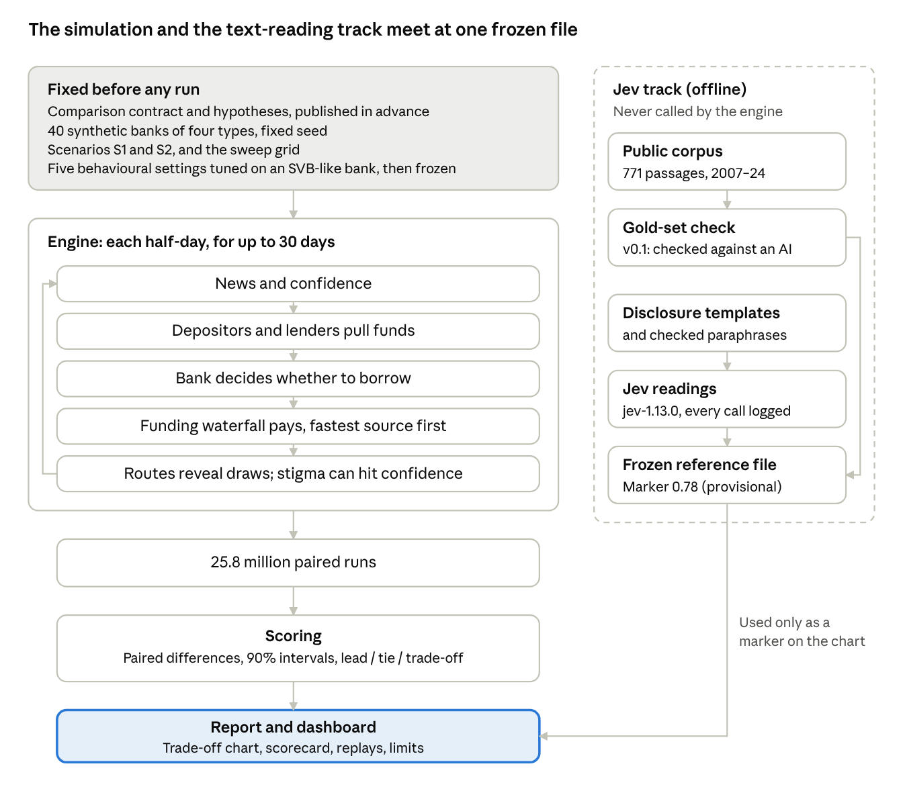
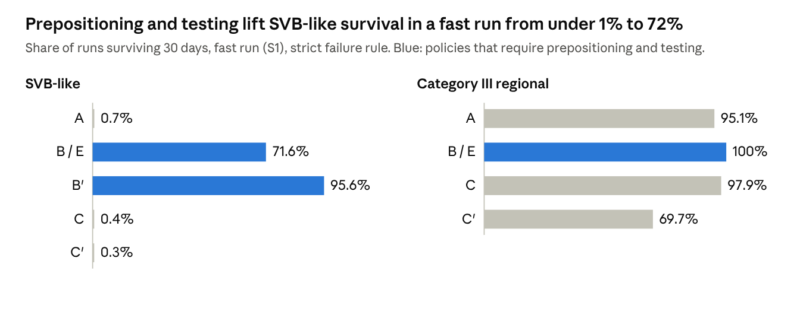

# Liquidity Policy Simulator: Methodology (v0.1)

Oct 9, 2026 · @Mike Hsu

> **v0.1 proof of concept.** The text-reading reference (Jev) has not been validated against human readers. These are not v1 results.
>
> **Disclosure.** The project's sponsor, Mike Hsu, publicly advocated a version of Option B while Acting Comptroller of the Currency. The comparison rules and hypotheses were published before any results existed. Option C's specification was reviewed by an outside supporter of LCR recognition. Results are reported whether or not they match the hypotheses.

## At a glance

The Liquidity Policy Simulator replays a bank run, day by day, under different rules for how banks prepare to borrow from the Federal Reserve's discount window, and counts which banks survive and at what cost. It compares the status quo (A) with a standalone readiness requirement (B), capped recognition of discount window capacity in the liquidity coverage ratio (C), and a prepositioning-and-testing mandate on its own (E), plus two variants (B′, C′).

**What v0.1 is.** A working proof of concept: the full pipeline runs end to end, from 40 synthetic banks through 25.8 million simulated episodes to a scored comparison, and reruns byte for byte in under ten minutes. It was built under a pre-registered protocol. That protocol was paused before its human-review steps were finished (section 4), so v0.1 shows what the method produces, not a validated answer.

**What it found, in one paragraph.** In this model, *operational readiness*, meaning whether a bank's collateral is already at the Fed and tested, decides who survives a fast run. Policies that require prepositioning and testing (B and E) carry SVB-like banks through runs that sink them under the status quo. Option C trades off: it helps some regional banks, but it encourages banks to swap cash-like assets for loans, which hurts the banks that need cash on day one. Stigma matters here only through how markets react once a draw becomes known. The model's banks never hesitate to borrow, so v0.1 does not test the hesitation story at the centre of the policy debate. The results depend on a strict rule that a bank fails the moment it cannot pay on time (section 12).

**How to read this document.** Each section starts in plain English. Technical detail for people who want to rerun or change the model is in the **Technical detail** notes, which name the files and decision records involved. Every rule cited as "Clarification" or "Amendment" is a dated entry in docs/amendments.md in the public repository.

## Architecture

The project has two parts that never run together. The simulation replays bank runs under each policy and scores the results. A separate, offline text-reading track uses Jev to estimate how markets read disclosures of borrowing. The two meet only at one frozen file, which places a single reference marker on the results chart.

Architecture · simulation engine and offline Jev track

Inside the engine, every half-day goes round the same loop: news moves confidence, depositors and lenders react, the bank decides whether to use the window, the funding waterfall pays what it can, and any draw that becomes known can knock confidence down further. Sections 5 to 7 describe each step.

## The question and the policies

**The question:** after the 2023 bank failures, should banks be required to be ready to borrow from the discount window (B), or should that readiness count toward the liquidity coverage ratio (C)? Both are live proposals. The simulator compares them on the same banks, the same runs and the same random draws.

| Policy | What it requires | Source |
|----|----|----|
| A, status quo | Nothing new. Voluntary, occasional test draws | Current rules |
| B, readiness requirement | Reserves plus prepositioned window capacity must cover five days of stressed outflows (40% of uninsured deposits, 100% of short-term wholesale funding). Mandatory prepositioning, quarterly \$50m test draws | Proposal summarized by [BPI, 2024](https://bpi.com/clear-recognition-of-the-discount-window-would-improve-liquidity-rules/) |
| B′ | As B, but only loans at the Fed count toward the ratio, not securities | Added after pre-registration (Amendment 3); exploratory |
| C, capped LCR credit | Window capacity against non-HQLA collateral counts toward the LCR, up to 20% of net cash outflows (30% under funding stress) and up to 75 × recent overnight borrowing. Voluntary: 75% of eligible banks opt in. Banks that opt in release cash-like assets (HQLA) into loans | [Treasury, March 2026](https://home.treasury.gov/news/press-releases/sb0412) |
| C′ | As C, with no cap tied to recent borrowing, so no draws are needed to earn credit | Suggested by the outside reviewer |
| E, mandate only | B's prepositioning and testing, without the five-day ratio | Isolates what the ratio adds |

Each policy is a combination of four switches, which lets the model attribute results to features rather than to whole packages:

| Switch                 | A   | B   | C   | E   |
|------------------------|-----|-----|-----|-----|
| Prepositioning mandate | off | on  | off | on  |
| Testing mandate        | off | on  | off | on  |
| Five-day ratio         | off | on  | off | off |
| LCR credit             | off | off | on  | off |

**Technical detail.** docs/contract.md sections 2 and 2a–2d; config/policies/policies.yaml. Option C is modelled as the full 2026 Treasury design (Decision C-1).

## How the comparison was fixed in advance

The sponsor has a stated view, so the design aims to make it hard for that view to shape the result. Every rule that could tilt the comparison was written down and made public before any policy was run under stress.

1.  **The comparison contract** fixes the banks, the policy rules, what observers can see, the swept assumptions, the cost inputs and the rule for when one policy "leads" another. It was frozen at tag pre-registration-v1.

2.  **The hypotheses** (H1–H8) record what the sponsor expected before any results, including where Option C might do better than B. They are kept unedited and scored against the results.

3.  **The behavioural settings** were tuned once, on an SVB-like bank under the status quo only, and frozen at tag params-frozen. A code test fails if any of them changes.

4.  **Every later change is a dated entry** in docs/amendments.md, saying what changed, why, and whether any result had been seen before the change. There are 31 clarifications and 9 amendments.

5.  **Results are reported as they come out.** Code, parameters and charts may change after results only to fix a mechanical bug proven by a new test, logged as an amendment.

6.  **The report layout was fixed on mock data** before any real result existed (Clarification 28), so no chart could be chosen to flatter an answer.

**The switch to v0.1 (Amendment 7).** The protocol planned for two people to label 278 news, speech and filing passages blind, as a test of the text-reading model (section 8). The second labeler became unavailable. Rather than wait, the sponsor released a proof of concept: the passages were labelled by another AI model, the text-reading reference is marked "provisional" throughout, and the full protocol is paused, not withdrawn. Every v0.1 output carries a banner saying so. A v1 release would use a fresh set of passages and independent human labelers.

**Technical detail.** Git tags: pre-registration-v1, params-frozen, M1-complete, corpus-v1, v0.1-signals, v0.1, v0.1.1. Hypotheses: docs/hypotheses.md. Outside review: docs/review-log.md.

## The banks and the funding model

The model uses 40 synthetic banks: 10 variants of each of four types, with values drawn at random (fixed seed) from ranges anchored on the 2023 failures. The same 40 banks face every policy.

| Bank type | Assets | Uninsured deposits | Securities | LCR applied | Anchored on |
|----|----|----|----|----|----|
| SVB-like (Category IV) | \$100–250bn | 80–95% | 40–60% of assets | Reduced, 70% | SVB |
| Diversified regional (Category IV) | \$100–250bn | 35–55% | 15–25% | None | Typical Category IV bank |
| Regional (Category III) | \$250–700bn | 35–55% | 18–28% | Reduced, 85% | Added after outside review |
| GSIB / large bank | \$700–2,000bn | 40–60% | 20–30% | Full, 100% | Largest banks |

One consequence is worth stating plainly: under today's rules the diversified regionals have no LCR, so Option C gives them no credit. That follows from current scope, not from the model.

**How a bank pays its depositors.** Every half-day, the bank meets withdrawals from the fastest sources first. Speed is what matters:

| Source | When the cash arrives |
|----|----|
| Reserves above a 1% operating floor | Same half-day |
| Same-day repo, within a line (3–20% of assets by type) | Same half-day |
| Home Loan Bank, within the pre-arranged line (5% of assets) | Same half-day; above the line, next day |
| Discount window, collateral prepositioned **and tested** in the last 90 days | Same half-day |
| Discount window, prepositioned but not tested | Next day |
| Discount window, securities not prepositioned | Next day |
| Discount window, loans not prepositioned | Not within 10 days (Signature's CRE "would take weeks to assess") |
| Securities sales | Treasuries next day, agency MBS two days, at a fire-sale discount |

This table is the heart of the model. Prepositioning and testing move window cash from "next day" or "weeks" to "same half-day". Section 12 shows that this is where nearly all the differences between policies come from.

**When a bank fails.** A bank fails if, at the end of a half-day, more than 0.1% of its starting assets in due payments are still unpaid, or its equity is negative. It fails even if cash it has already arranged would arrive the next morning. This strict rule matches how SVB and Signature ended, and the results depend on it (section 12). A bank that gets through three calm days in a row is counted as stabilized.

**Technical detail.** Archetypes: docs/contract.md section 1, config/banks/archetypes.yaml. Collateral is split 30% at the Fed, 40% at the Home Loan Bank and 30% unpledged before any policy applies (Clarification 4). Waterfall rules, settlement and fire-sale impact: Clarification 5, config/funding.yaml. Failure and end conditions: Clarification 10, config/decision.yaml.

## Behaviour: depositors, lenders, the bank and the supervisor

Each episode starts with a piece of bad news on the morning of day 1 and runs for up to 30 days in half-day steps. Four kinds of actors respond, using simple rules that are identical under every policy. No rule in the code takes a policy's name as an input.

**Depositors** watch a single number, the bank's *confidence*, which falls with the news shock, with losses on the bank's securities, and with how much money has already left. Once confidence drops below a tolerance level, uninsured depositors start to leave, and each withdrawal lowers confidence further. That feedback is what turns a shock into a run.

- *Fast* depositors react within the half-day: 90% of uninsured deposits at SVB-like banks, 40% at regionals, 15% at the largest banks.

- *Slow* depositors react a day later.

- *Insured* depositors leave at a twentieth of the fast rate.

**Wholesale and repo lenders** each have a confidence cut-off. As confidence falls through the band, more of them refuse to roll their funding. The Home Loan Bank and the Fed keep lending, as they did in 2023.

**What observers learn, and when.** Observers learn about a discount window draw only through specific routes: the Fed's weekly aggregate report (no bank named, and less revealing when many banks borrow), a mandatory filing once borrowing reaches 5% of assets, a leak (20% chance within the episode), and the supervisor, who sees every draw the same day.

**Stigma.** When a draw becomes known, there's a chance it is read as a sign of distress. That chance is *market stigma*, the main swept assumption, from 0 to 0.9. A distress reading knocks confidence down by a fixed amount (0.25, swept 0.10 to 0.40), which can deepen the run.

**Routine borrowing lowers stigma.** The more often banks borrow routinely, the less a single draw stands out. Each policy implies a routine borrowing rate *r* per bank per quarter: 0.1 under A and C′, 1.0 under B and E (quarterly tests), and 1.9 under C at 75% uptake (usage draws). Effective stigma falls with *r*; the strength of that effect, *s*, is swept from 0 (no effect) to 0.7.

$$
\sigma_{\text{effective}} = \sigma_{\text{market}} \times e^{-s \, r}
$$

**The bank's decision.** Each half-day the bank compares two risks: the chance of failing without the window, against the chance a draw becomes known, times the chance it is read as distress, times the damage that does, plus the supervisor's displeasure. It borrows if failing is the bigger risk.

**The supervisor's dial** sets how much a draw costs the bank in examiner attention: from "strongly penalizes" (0.30 of a failure) through "neutral" (0.05) to "strongly encourages" (0). Routine borrowing lowers this cost too, by the same rule as market stigma.

**Technical detail.** Depositors and lenders: Clarification 8, config/agents.yaml; confidence C = 1 − S(1+ε)(1+g) − cR, withdrawal share 1 − e^(−a·max(0, θ − C)) per half-day (Amendment 2). Information routes and stigma: Clarification 9, config/information.yaml. Borrowing rule: Clarification 10, config/decision.yaml. Routine-borrowing effect: contract section 3a.

## Scenarios, tuning and validation

**Two scenarios.**

- **S1, fast run:** a large piece of bank-specific bad news on day 1 (a shock of 0.5 in confidence units). This is the SVB-type case.

- **S2, false alarm:** a smaller rumour (0.45). A sound bank should ride it out without needing the window. S2 tests whether a policy causes needless borrowing.

**Tuning.** Five behavioural settings can't be taken from public data, so they were tuned once. The tuning used one bank, built from SVB's end-2022 balance sheet, under the status quo only, and asked the model to reproduce SVB's 2023 outflows. The five settings are depositor sensitivity (with its tolerance level), coordination strength, the slow-depositor lag, the wholesale roll threshold and the fire-sale price impact. The values were then frozen.

The fit is partial, and the report says so:

- day 1 outflows came out 17% above 2023's, and day 2 cumulative outflows 37% below;

- none of the 69,855 combinations searched matched both days, because the model's runs start hard and fade, while SVB's accelerated on day 2;

- the SVB pattern can't pin down two of the five settings (the roll threshold and fire-sale impact), so those keep their pre-tuning values.

**Out-of-sample checks** (rules fixed before any check ran; a failure is reported, not fixed by retuning):

| Check | Result |
|----|----|
| Signature-like bank, S1: most runs fail by day 3, with a day-1 outflow of 10–40% of deposits | Pass. All runs fail; median day-1 outflow 23%, against 20% in 2023. The model fails it on day 1, two days earlier than in 2023 |
| First Republic-like bank: survives past day 5 with heavy official support | Fail. It survives, but its run is about a fifth of 2023's and its peak support about an eighth |
| False alarm (S2) on all 40 banks: the regional and largest banks ride it out | Pass. 20 of 20 survive with no shortfall and no window borrowing |
| No shock: every bank stays calm | Pass |

The First Republic failure points to the same limit as the tuning: the model can't sustain a slow, rolling run.

**Technical detail.** Scenarios: config/scenarios/scenarios.yaml; S2 raised from 0.15 to 0.45 before any S2 run (Amendment 5). Tuning: Clarification 15, config/params_frozen.yaml (fingerprint 05f9e763efc16772), outputs/tuning_report.html. Checks: Clarification 16, outputs/validation_report.html.

## The role of Jev

Market stigma can't be measured directly, so the model sweeps it across the whole range rather than assuming one value. Jev, a text-judgment model from TypeSafe, supplies one *reference point* on that sweep: an estimate of how readers take the kinds of disclosure each policy produces. It is a marker on the chart, not an input to the simulation. **Jev never runs inside the simulation**, never does arithmetic, and is called only offline, through one logged client, pinned to a single model version (jev-1.13.0).

**1. A corpus of real language.** Public passages about banks borrowing from central banks, 2007–2024: Fed, ECB and Bank of England speeches and statements, NY Fed research, SEC filings, congressional hearings, and Guardian and New York Times news. AI reviewers checked more than 6,000 candidate passages for *relevance only*, never tone, under a written instruction; the sponsor hand-checked a random 50 of their decisions. 771 passages qualified. News excerpts stay private for copyright reasons; the public record holds links and fingerprints.

**2. A gold-set check (the step v0.1 couldn't complete).** The plan was for two people with opposite priors to label 278 passages blind, on a four-point scale from Reassuring to Clear Distress, and to show Jev's estimate only if Jev agreed with them about as well as they agreed with each other. In v0.1 the labels came from another AI model (GPT-6.1 Sol), reviewed by eye. Jev and that model agreed moderately (Krippendorff's α = 0.62; 0.81 on passages the other model was confident about), mostly disagreeing over whether calm passages were "Reassuring" or "Routine". That is agreement between two models, not validation against people.

**3. The reference marker.** Jev read each policy's disclosure templates (a news leak, a weekly Fed report, a bank's filing) in several checked paraphrases, from three vantage points: a depositor, a wholesale lender and an analyst. Its readings average to a "chance a known draw is read as distress" of **0.78 under the status quo** (range 0.49–0.91). That value is the marker on the chart.

The markers under other policies are kept off the chart on purpose. Under B and E, Jev's reading is lower (0.65), because their disclosures frame draws as routine tests. The model already applies that routine-borrowing effect, so placing B's lower marker on the axis would count the same effect twice (Clarification 31). Instead, the gap is used as a rough check: B against A implies s ≈ 0.2, inside the swept range. C against A implies s ≈ 0: Jev doesn't read C's capacity-building draws as any more routine than status-quo borrowing.

**A known tilt.** The contract flagged in advance that three templates (AN6, L2, W2) let a bank describe a draw as a routine test, which may favour B and E. Those are the templates that lower B's reading.

**4. The historical range.** Jev also scored all 771 corpus passages. Crisis-era news reads as distress (80% of news passages); filings (5%) and pandemic-era text (10% in 2020–21) read as routine. Who is writing, and when, matters far more than anything else.

**Technical detail.** signals/frozen/method_note.md; client signals/jev_client.py (mock mode, audit log, gold-set guard); corpus rules: Clarifications 20–24 and signals/corpus/eligibility_instruction.md; check and markers: Clarification 30; marker placement: Clarification 31; all frozen files fingerprinted in signals/frozen/MANIFEST.json.

## Human review points

The coding was done by AI coding agents, directed by the sponsor, who does not write code. Judgment calls were reserved for people and recorded. In order:

| Step | Who | What was decided or checked | What it changed |
|----|----|----|----|
| Comparison contract | Sponsor | How to model C, SVB-like banks' LCR status, B's run-off rates, whether B's ratio is public, cost defaults | Fixed the terms before any run |
| Hypotheses H1–H8 | Sponsor | Expected results, written before any run | Scored unedited against the results |
| Review of Option C | Outside reviewer who supports LCR recognition (anonymous at their request) | Whether C was specified fairly | Added the stress-adjustable ceiling, the HQLA-release sweep, the C′ variant, the Category III bank type, and the routine-borrowing effect on supervisors |
| Model-building choices | Sponsor | About 20 rules the contract left open: collateral split, same-day repo, the depositor tolerance level, B′, the failure rule | Logged as Clarifications 1–18 and Amendments 1–6 before the results they could affect |
| Out-of-sample checks | Sponsor | Pass criteria fixed in advance | One failure reported and left unfixed |
| Corpus relevance | Sponsor | Hand-check of 50 AI relevance decisions; rulings on borderline cases | Confirmed the eligibility rule before the full collection |
| Gold-set labeling | Planned: sponsor and the outside reviewer, blind | Not completed. The sponsor labelled 15 practice passages; the 278 main passages were labelled by an AI model | Triggered the switch to v0.1 (Amendment 7) |
| Paraphrase review | Sponsor | Whether each rewording of a disclosure kept its facts | Dropped one paraphrase and corrected two |
| Marker placement | Sponsor | Use A's marker on the chart; per-policy markers as a check only | Avoided counting one effect twice (Clarification 31) |
| Results diagnostics | Sponsor | Which sensitivities to run after seeing results; no scored result changed | The Sensitivities page and three new limits (Amendment 9) |

**What reviewers would most usefully check next:** the failure rule (section 5), the borrowing decision (section 6), the Option C specification after review, and the full human gold-set test that v1 requires.

## Running and scoring

**The grid.** Every policy runs on every bank, in both scenarios, at every combination of seven market-stigma levels (0 to 0.9) and five supervisory stances: 35 cells. Further sweeps around the defaults cover the routine-borrowing strength, the distress hit, Option C's settings (ceiling, usage multiple, uptake, HQLA released), collateral margins, cost rates and depositor coordination. In all, 25,832,000 episodes ran in 7.5 minutes on a laptop.

**Paired runs.** Each run's random draws (how hard the news lands, whether a leak happens, how a known draw is read) are drawn up front and shared across policies. A run under B faces exactly the same luck as the same run under A, so differences come from the policy, not chance.

**What is measured,** for each policy, scenario and bank type:

- survival rate within 30 days;

- liquidity shortfall (cash no source could cover);

- official support drawn from the discount window (Home Loan Bank lending is reported separately);

- annual cost;

- effective stigma and routine borrowing frequency;

- the hesitation gap (days between needing the window and using it);

- false comfort (reported LCR ≥ 100% but the bank fails within 7 days);

- needless borrowing in the false alarm.

**When a policy leads.** Every comparison is a paired difference with a 90% interval. A policy *leads* if it is at least as good on both survival and shortfall, and clearly better (its interval excludes zero) on at least one. Otherwise the cell is a *tie*, or a *trade-off* against cost. There is no composite score and no dollar value placed on a failure.

**Costs** are annual, steady-state and per bank. They cover the forgone use of prepositioned collateral (2 bp a year for Treasuries, 15–20 bp for loans), test and usage draws at the spread between the primary credit rate and interest on reserves, extra reserves where B's ratio binds, and, as a saving under C, the yield on cash-like assets moved into loans (250 bp). C's saving and its thinner cash buffer are the same money, so the report shows them side by side.

**Technical detail.** Run plan: Clarification 14, config/run_plan.yaml; scoring: contract section 4, config/analysis/m3.yaml; costs: Clarification 13, config/costs.yaml. Outputs: outputs/v0.1/report/ (scorecard, trade-off chart, frontier, Option C panel, reversal distances, feature attribution, episode replays, hypotheses, sensitivities, limits).

## Key assumptions and how to change them

These are the assumptions a reader is most likely to question. The first four drive the results most. Every value lives in a plain-text config file; changing one and running make results reruns everything. Under the project's rules, any change for a new release goes through a dated amendment.

| Assumption | v0.1 value | Swept? | Why it matters | Where |
|----|----|----|----|----|
| **Failure rule** | Fails at the end of any half-day with unpaid payments above 0.1% of assets, even if cash arrives next morning | No (the grace count is reported as a sensitivity) | Nearly all policy differences run through it (section 12) | config/decision.yaml (Clarification 10) |
| **Window speed** | Same half-day only if collateral is prepositioned and tested; next day if not tested; loans not prepositioned unusable for 10 days | No | This is the mechanism by which B and E help | config/funding.yaml (contract section 7) |
| **The borrowing decision** | Borrow when the chance of failing outweighs the expected cost of stigma and supervisory displeasure | Partly (stigma, supervisor, distress hit) | The model's banks never hesitate, so the hesitation debate is untested | config/decision.yaml (Clarification 10) |
| **Routine-borrowing strength s** | 0.3 | 0, 0.3, 0.7 | Drives C's gains for banks without LCR credit | config/run_plan.yaml (contract 3a) |
| Market stigma | Swept; Jev reference 0.78 | 0–0.9, 7 points | The main swept assumption | config/run_plan.yaml |
| Supervisory stance | Five settings, from 0.30 of a failure to 0 | Yes | No effect in v0.1, because banks always borrow | config/information.yaml (Clarification 9) |
| Distress hit | 0.25 of confidence | 0.10, 0.25, 0.40 | How hard a known draw lands | config/run_plan.yaml (Amendment 1) |
| Fast depositor share | 90% / 40% / 40% / 15% by bank type | No | How fast runs start | config/agents.yaml (Clarification 8) |
| Five tuned behavioural settings | Frozen from the SVB fit | No | Run speed and shape; two of them not identified by the data | config/params_frozen.yaml (Clarification 15) |
| Starting collateral split | 30% Fed / 40% Home Loan Bank / 30% unpledged | No | How much fast window capacity A banks start with | config/funding.yaml (Clarification 4) |
| Option C settings | 20% ceiling, k = 75, 75% uptake, 100% HQLA released | Yes, each | C's benefit and cost | config/policies/policies.yaml, config/run_plan.yaml |
| B's run-off rates | 40% of uninsured deposits, 100% of short-term wholesale over five days | Full run as a sensitivity | How much B requires | config/policies/policies.yaml (Decision 2-2) |
| Collateral margins | Fed's July 2026 table | ±5 pp | Window capacity | config/funding.yaml (contract 2b) |
| Cost rates | 2–20 bp collateral; 250 bp loan–reserve spread | ×0.5–1.5 | Cost comparisons only | config/costs.yaml (Clarification 13) |
| Calendar | Every half-day is a business day; no weekends, no BTFP, no contagion between banks | No | No bank gets a weekend to mobilize collateral | Engine (Clarification 17) |

**The two changes most worth trying first:** (1) a bridged first night under A, letting a bank whose cash is already on its way survive and keep running, which tests whether something other than prepositioning could do B's job; and (2) a borrowing decision with real hesitation, such as a manager's personal cost of borrowing or an organizational delay.

## What v0.1 found

Under the strict failure rule, requiring banks to preposition and test their collateral is what saves SVB-like banks in a fast run. Every other policy leaves them failing.

v0.1 scorecard (outputs/v0.1/report/scorecard.csv) · S1, default settings, strict failure rule

**Policy by policy** (S1, across the 35 stigma-by-supervision cells):

- **B and E lead A** in every cell for SVB-like, diversified regional and Category III banks, and in 20 of 35 cells for the largest banks.

- **B and E are identical everywhere.** At default settings B's five-day ratio never binds, because the mandated prepositioning already meets it. Median cost: \$6.4m per bank a year.

- **B′**, where only loans count toward the ratio, lifts SVB-like survival further, at about \$386m more per bank a year. Exploratory: no hypothesis covered it.

- **C trades off by bank type** against A. It leads for Category III banks (all 35 cells) and diversified regionals (26), ties for the largest banks, and loses for SVB-like banks (A leads in 20 cells). C's saving, a median \$133m per bank a year, comes from swapping cash-like assets for loans, and that cash is what an SVB-like bank needs on day one.

- **C′ is worse than C** for every bank type. It releases the same cash but makes no usage draws, so the bank's collateral is never tested.

- **B leads C** in every SVB-like cell, in both scenarios.

**Why.** 98.4% of failures are pure timing failures: the cash had been agreed but arrived too late. Stigma matters only once a draw becomes known (under B, SVB-like survival falls from 78% to 63% across the stigma range). The supervisory dial changes nothing, because in the model a bank facing a run always borrows.

**The hypotheses**, scored unedited:

|  | Expected | Result |
|----|----|----|
| H1 | B and C about equal in mid-range conditions | Not supported: B leads C in all 9 mid-range cells |
| H2 | No prediction on B vs E | B and E tie everywhere |
| H3 | C could be worse than A for SVB-like and Category III banks | Supported in its main form; not in its strong form |
| H4 | C ties or leads B under low stigma, full uptake or encouraging supervisors | Not supported: B leads C under each condition |
| H5 | C raises false comfort | Not supported (+0.29 pp for SVB-like banks; no effect for the largest) |
| H6 | Cost order B \> E \> A \> C \> C′ | Not supported: B costs the same as E, and C the same as C′ |
| H7 | Supervision matters about as much as policy | Not supported: supervision moves survival by 0 pp, against a 72 pp policy swing |
| H8 | No extra needless borrowing in the false alarm | Supported |

**Sensitivities** (reported, not scored):

- **Counting timing-only failures as survivals.** Almost every bank then survives, and for SVB-like banks A appears to beat B. The comparison isn't like for like: A's runs stop at a day-1 failure and never face the heavier withdrawals of days 2–7, while B carries the bank through about \$140bn of withdrawals that A's run never reaches. A fair test needs a variant in which something bridges A's first night and the run continues (section 13).

- **No routine-borrowing effect (s = 0).** C's advantage for diversified regionals disappears, and B's lead over C widens.

- **Hesitation.** No run, under any policy, borrowed a day or more after it first needed to.

- **Shortfall measured as the largest amount still owed.** SVB-like banks still owe a median \$8.9bn under A, against \$0.75bn under B and E. Only one set of labels changes (C vs A for SVB-like banks becomes a tie in all 35 cells).

## Limits and what v1 would change

The biggest limits are the ones that bear on the B-versus-C question itself:

| Limit | Why it matters | What v1 (or v0.2) would do |
|----|----|----|
| **The results depend on the strict failure rule.** A bank fails the moment it can't pay, even with cash arranged for the next morning | B's whole advantage is bridging that gap. If something else bridged it, B might add little | Run "A plus an overnight bridge": the bank survives the first night if its cash is on the way, and the run continues |
| **Model banks never hesitate.** The borrowing rule always favours borrowing when failure is likely | The policy debate is about hesitation; v0.1 can't speak to it | Give managers a personal or reputational cost of borrowing, or an organizational delay, and tune it to 2023 evidence |
| **Runs fade after the first morning.** SVB's accelerated on day 2; the model's can't | Slow, rolling runs like First Republic's are too mild (a failed validation check) | Add a mechanism by which news or social contagion speeds a run up |
| **The text reference is unvalidated.** Jev was checked only against another AI | The marker on the chart is provisional | A fresh set of passages, labelled blind by at least two independent people |
| **C's gains for banks without LCR credit rest on an assumption** that C's draws normalize borrowing for everyone | Jev's reading suggests they don't | Treat s for C as separately uncertain, or estimate it |
| **Disclosures move no one.** Scheduled ratio disclosures (B's ratio, C's LCR) don't affect depositors or lenders | C's reported LCR can't reassure or mislead | Let scheduled disclosures shift confidence |
| **One bank at a time.** No contagion between banks, no weekends, no BTFP | System-wide stress and weekend timing are outside v0.1 | Multi-bank scenarios |
| **Two behavioural settings are not identified** (wholesale roll threshold, fire-sale impact) | Results that turn on wholesale refusals or securities sales rest on starting values | Calibrate on an episode with heavy wholesale funding |
| **The 2007–09 corpus is thin** (110 passages against a target of 150) | The historical range is less reliable for that period | More archival sources |
| **Cliff-edge ties.** A bank either stays calm or runs | Some ties mean no policy reached the bank, not that the policies are equal | Report where ties come from |

The full list, with the record entry for each, is on the report's Limits page (outputs/v0.1/report/limits.html).

## Reproducing the results

The whole comparison reruns from the published code, configuration and frozen Jev files in about ten minutes on a laptop, with no calls to Jev.

1.  Clone the public repository and check out tag v0.1.2 (or v0.1 for the original run).

2.  Run make results. It runs the full grid and writes the results to `outputs/results/` and the report to `outputs/report/`. The copies in `outputs/v0.1/` are the published snapshot to compare against.

3.  Open `outputs/report/index.html`.

A rebuild from scratch matches the published outputs byte for byte, apart from timestamps and the commit stamp. Every output page carries a stamp with the code version, a fingerprint of the configuration, the frozen-parameter fingerprint (05f9e763efc16772) and the Jev file version (v0.1-signals).

**To change an assumption,** edit the config file named in section 11 and run make results again. The frozen behavioural settings are protected by a test, so changing them is deliberate: update the fingerprint and record why.

**Where things are:**

| Folder or file | What it holds |
|----|----|
| docs/contract.md, docs/hypotheses.md, docs/amendments.md | The rules, the expectations, and every dated change |
| config/ | Every setting, in plain text |
| engine/, agents/, cost/, analysis/ | The simulation, the behaviour rules, the cost model and the scoring |
| signals/ | The Jev client, corpus rules, gold set, templates, and the frozen Jev outputs (signals/frozen/) |
| validation/, outputs/tuning_report.html, outputs/validation_report.html | Tuning and out-of-sample checks |
| outputs/v0.1/report/ | The v0.1 report |
| tests/ | About 400 tests of the mechanics, including the freeze guards |
